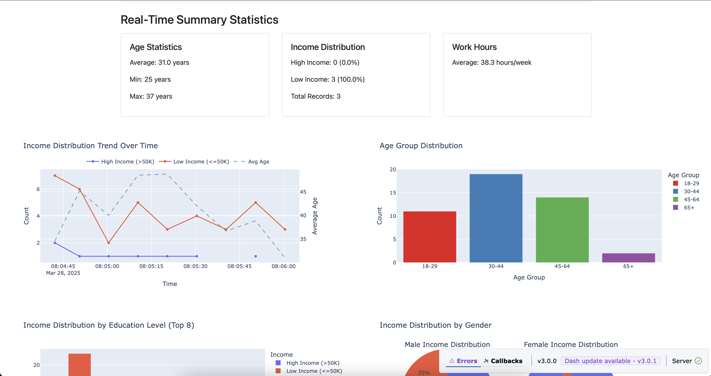

# Real-Time Census Data Analytics Dashboard

A streaming data analytics pipeline that processes census data in real-time, extracts insights, detects anomalies, and visualizes results through an interactive dashboard.



## Architecture

```
┌─────────────────┐     ┌────────────────┐     ┌──────────────┐     ┌──────────────────┐
│ Stream          │     │ Apache Spark   │     │              │     │ Interactive      │
│ Simulator       │────▶│ Streaming      │────▶│   MongoDB    │────▶│ Dash Dashboard   │
│ (CSV files)     │     │ Processing     │     │              │     │                  │
└─────────────────┘     └────────────────┘     └──────────────┘     └──────────────────┘
```

## Features

- **Real-time data processing** with Apache Spark Streaming
- **Anomaly detection** using statistical z-score analysis
- **Interactive dashboard** with multiple visualization types
- **Filterable time range** to analyze data from different periods
- **Demographic insights** including age, education, income, and gender analytics
- **MongoDB integration** for data persistence

## Prerequisites

- Python 3.8+
- Apache Spark 3.x
- MongoDB Atlas account
- Pandas, PySpark, Dash, Plotly

## Project Components

### 1. Stream Simulator (`stream_simulator.py`)

Simulates streaming data by generating batches of census records from a source CSV file at 10-second intervals. Introduces occasional anomalies in work hours to demonstrate anomaly detection.

### 2. Spark Streaming Processor (`spark_streaming.py`)

Processes incoming data streams using Apache Spark:
- Reads CSV files as they appear in the stream directory
- Enhances data with derived features like age groups and income categories
- Calculates real-time statistics and aggregations
- Detects anomalies using z-score analysis
- Stores processed data and analytics in MongoDB collections

### 3. Interactive Dashboard (`dashboard.py`)

Real-time analytics dashboard built with Dash and Plotly:
- Summary statistics cards showing key metrics
- Time series visualization of income trends
- Age distribution analysis
- Education vs income comparisons
- Gender-based income distribution
- Occupation analysis
- Anomaly visualization

### 4. Database Reset Utility (`reset_database.py`)

Utility to clear all MongoDB collections before starting a new streaming session.

## Getting Started

### Setup

1. Clone the repository:
   ```
   git clone <repository-url>
   cd spark_mongo
   ```

2. Install dependencies:
   ```
   pip install pyspark pandas dash plotly pymongo
   ```

3. Update MongoDB connection string in all scripts with your credentials

### Running the Application

1. **Reset the database** (optional, for clean start):
   ```
   python reset_database.py
   ```

2. **Start the data stream simulator**:
   ```
   python stream_simulator.py
   ```

3. **Start the Spark streaming processor** in a new terminal:
   ```
   python spark_streaming.py
   ```

4. **Launch the dashboard** in a new terminal:
   ```
   python dashboard.py
   ```

5. Open your browser and navigate to `http://127.0.0.1:8050/` to view the dashboard

## Dashboard Controls

- **Update Frequency**: Control how often the dashboard refreshes (5, 10, or 30 seconds)
- **Time Range**: Filter data displayed on the dashboard:
  - Last 5 minutes
  - Last 15 minutes
  - Last 30 minutes
  - All data

## Data Source

The project uses a modified version of the Census Income dataset, which includes:
- Demographic information (age, gender, race)
- Education and work details
- Income classification
- Capital gains/losses

## Troubleshooting

- **Missing Data**: Ensure the stream simulator is running and generating files
- **Connection Issues**: Verify MongoDB connection string and network connectivity
- **Spark Errors**: Check Java version compatibility with your PySpark installation
- **Empty Visualizations**: The time range filter may be excluding available data

## License

[MIT License](LICENSE)
